# lager-cli
An npm library for managing a local Kubernetes infrastructure, including cluster setup, service deployment, load testing with k6, and cluster teardown.

## Reproducibility

This repository provides all necessary artifacts to reproduce the experimental results presented in the thesis.

The environment can be fully recreated and be tested by using:

- lagerr setup
- lagerr test
- lagerr destroy

## Networking / Host Configuration

During `lagerr setup`, the required host entries (e.g. `proxy.localhost`, `rmq.localhost`, `monitoring.localhost`) are automatically added to the system's hosts file.

This allows accessing services via browser without manual configuration.

Note:
- On macOS, this requires elevated permissions (sudo)
- If this step fails, the domains must be added manually to `/etc/hosts`
  - 127.0.0.1 proxy.localhost
  - 127.0.0.1 monitoring.localhost
  - 127.0.0.1 rmq.localhost

## Kubernetes Setup

The system uses a local Kubernetes cluster via KIND.

KIND and kubectl must be installed manually before running `lagerr setup`.

The `lagerr setup` command will then create and configure the cluster automatically.

## Repository

The full source code and all artifacts are available at:

https://github.com/cemildo/lagerr  
https://github.com/cemildo/lagerr-cli

# Installation

## 1 -  Prerequisites

### node version
v24.7.0

### npm version
9.8.0

### Docker Desktop: 
v4.15.0

### kind version
kind v0.30.0 go1.25.0 darwin/arm64
(if not installed `brew install kind`)

### kubectl version
Client Version: v1.34.0
Kustimize Version: v5.7.1
(if not installed `brew install kubectl`)

## 2 - download both lagerr and lagerr-cli 
make sure you download both repos in the same folder because we will need to set up root path for lagerr-cli to find files under infrastructur folder.
 
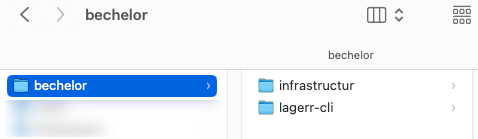

## 3 - navigate into lagerr-cli
> `npm install -g . `
this will install the library in your computer in the global npm folders, so it is usable in every terminal you open. if it does not appear in your current terminal, close the terminal session and open a new one and type `lagerr` you should get something like: 

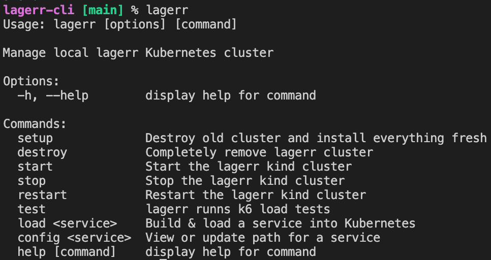

## 4 - install local kubernetes 
run `lagerr setup` this will install all the necessary components and it takes couple of minutes. In the installation process it will ask you the root path:

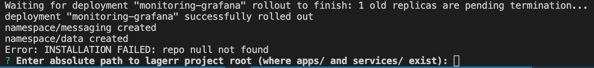

open a new terminal and navigate into your `infrastructure` folder (the folder that comes with git clone https://github.com/cemildo/lagerr) and run `pwd` this will give you the root path relative to your computer. for me it is `/Users/cemildogan/cddev/bechelor/infrastructur`, find yours and copy and paste it in the `lagerr setup` terminal and hit enter. It will continue installation process and finally you should see the following screen:

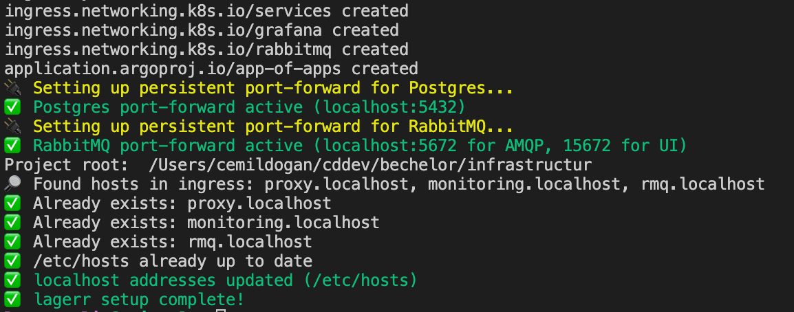

now, when you open `docker desktop` you should see `lagerr-control-plane` is up and running

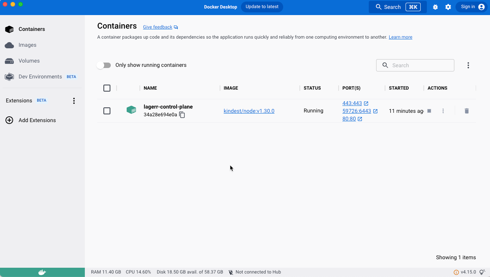

a couple of minutes needed to start all the containers to be up and running. I personally use a tool called `Lens` (`https://lenshq.io/products/lens-k8s-ide`) to take a look at inside kubernetes and run some commands. this tool had a problem to find local cluster, a work around is: it needs to be started from the terminal.

if you prefer to have it, install it and run it by `open -a Lens` command. this will bring up the following screen.

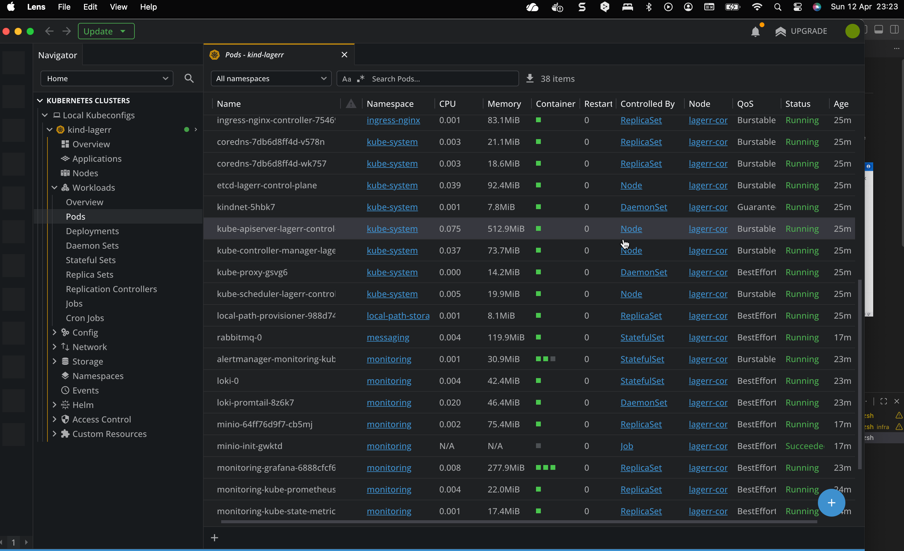

## 5 - get PostgreSQL ready

check if postgres pod is installed and deployed, if not you need to `lagerr destroy` and `lagerr setup` again. :/

- if you find postgres pod then you must connect to it:
  * check if port 5432 is forwarded, if not, do the forwarding in kubernetes `kubectl port-forward pod/<pod-name> 5432:5432` so we can reach it from outside of the kubernete cluster. If you get connection problems remove forwarding and do it again.
  
  then use this password  `app123` and following settings to connect database with a program that allows you to connect and run queries on database.

  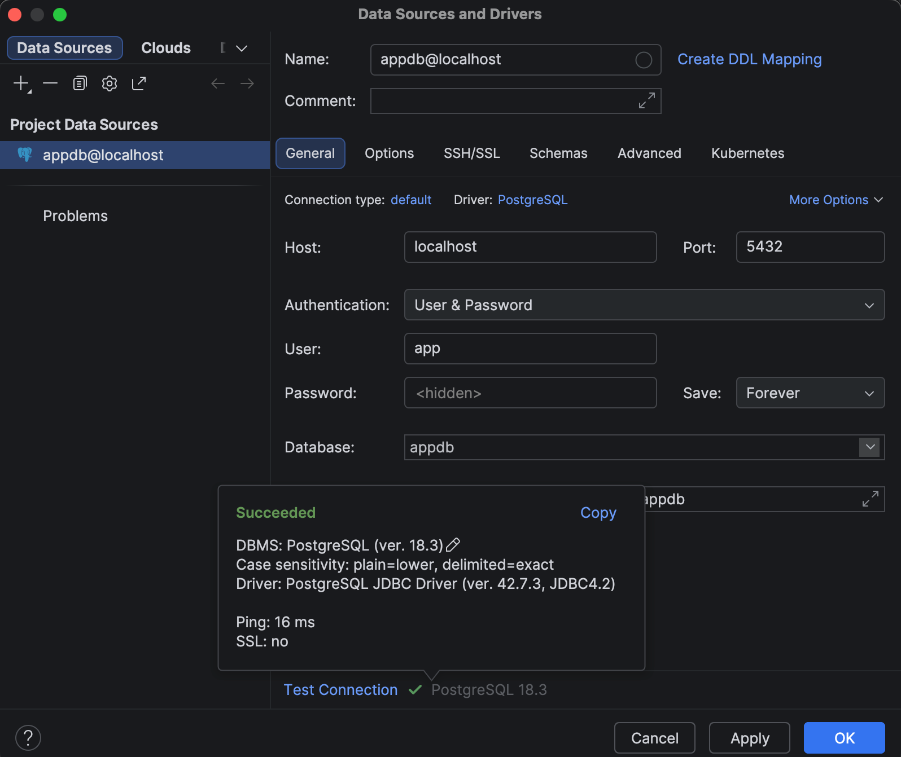

- add following schema (it is a must!):
   
  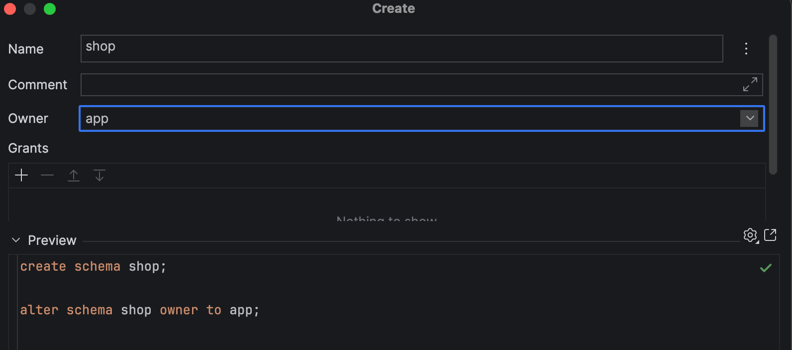 

## 5 - deploying services
Right now none of the services are deployed we need to deploy them one by one.

open a terminal and run `lagerr load order` this will build the order microservice image and deploy it to local kubernetes cluster (depending on where you run this command it might ask for permission hit `allow`).
If everything is successfull, you should see the following screen, which means service is successfully deployed. 

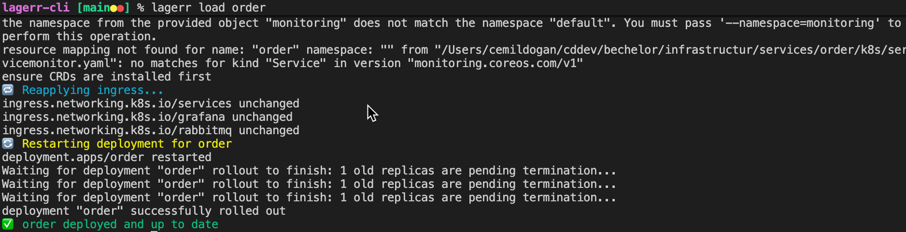

then run the rest one by one `lagerr load notification`, `lagerr load payment`, `lagerr load lager`

if you would like to change any environment variable (SAGA -> SAGA_OUTBOX or SAGA_OUTBOX -> SAGA) you can change it under each micorservice code `k8s/deployment.yaml` and in the `env: ...` section and run deployment script again `lagerr load <service-name>`. Or you can change it directly in kubernetes related deployment.yaml and restart the pod.

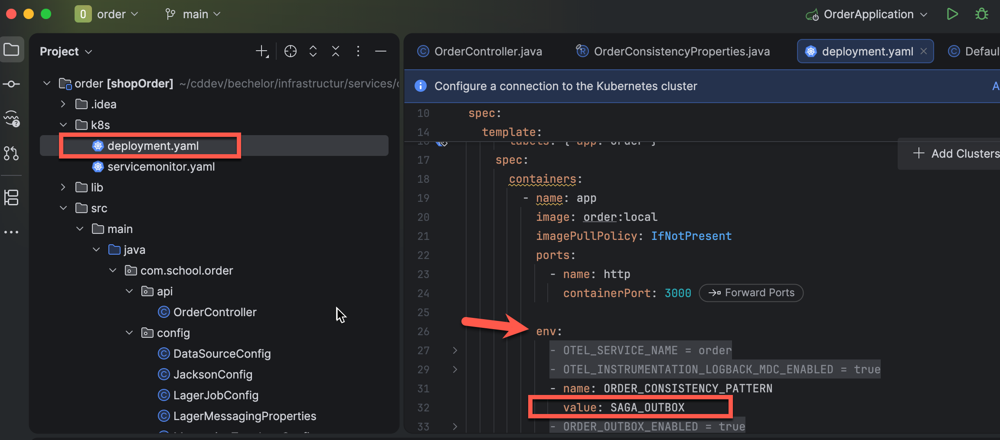

## Monitoring tools 
you can also visit monitoring tools in the browser: 

for RabbitMQ: `rmq.localhost` in the browser, and the credentials are:
- user: `app`
- pass: `app123`
  

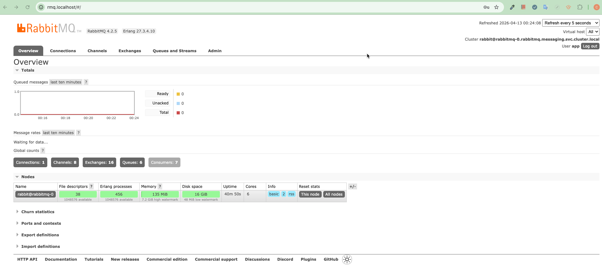

for Grafana: type `monitoring.localhost` in the browser, and the credentials are:

- user: `admin`
- pass: `kubectl get secret --namespace monitoring -l app.kubernetes.io/component=admin-secret -o jsonpath="{.items[0].data.admin-password}" | base64 --decode ; echo` or alternatively you can take a look environment varibales of monitoring-grafana-xxxxxxxx pod (the password is not fixed password, it changes on every new cluster setup) where you can also find the password. 

as you see below in the image, i have created a dedicated dashbord which shows a lot of related metrics. ( Dashboards > Bachelor Thesis - Saga / Outbox Metrics )

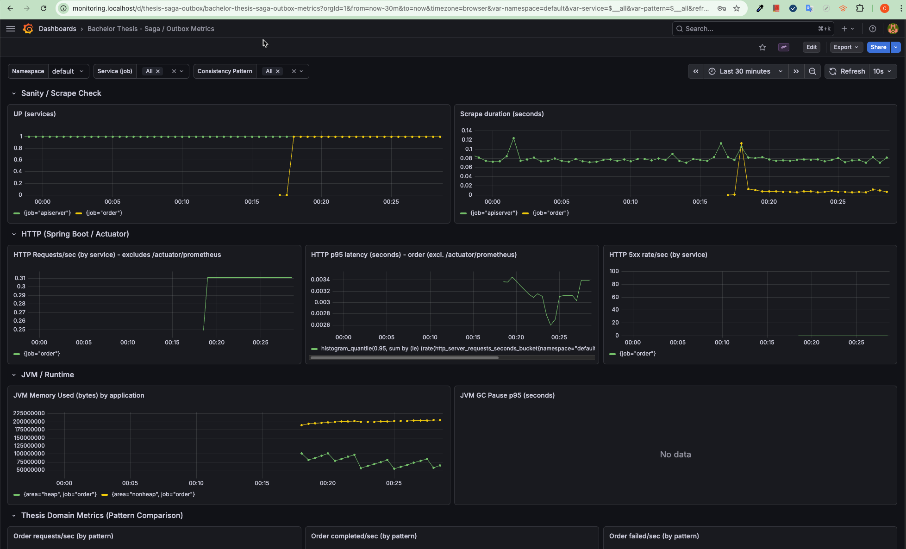

## Testing with curl

Run this query from terminal 

```
curl --location 'proxy.localhost/order/api/orders' \
--header 'Content-Type: application/json' \
--data '{
    "customerId": "4e8d1455-c201-474f-a7f4-4df1acb2978c",
    "items": [
        {
            "productId": "e1690c12-1000-4b01-b4b1-000000000006",
            "quantity": 1
        },
        {
            "productId": "e1690c12-1000-4b01-b4b1-000000000003",
            "quantity": 1
        }
    ]
}'
```

you should get some think like this as response:

```
{
    "id":"f3238a97-bc64-41ab-8bd0-255b1e6d7d3c","customerId":"4e8d1455-c201-474f-a7f4-4df1acb2978c","totalAmount":2098.00,
    "status":"PAYMENT_PENDING","createdAt":"2026-04-12T22:47:14.753086591Z","updatedAt":"2026-04-12T22:47:14.753086591Z"
}
```

## Testing with k6

k6 must be installed locally and available in the system PATH. The load test script uses the external k6 utility library from jslib.k6.io. Internet access is required.

### macOS, if k6 is not installed
`brew install k6`

The load test script is located in: `lib/k6/order.k6.js`

### Load Test Profile

The k6 script uses a staged load profile:

- Ramp-up: increasing virtual users
- Steady load phase
- Ramp-down phase

The goal is to simulate realistic system load conditions.

Run the following command in a terminal to start grafana k6 tests: `lagerr test`.

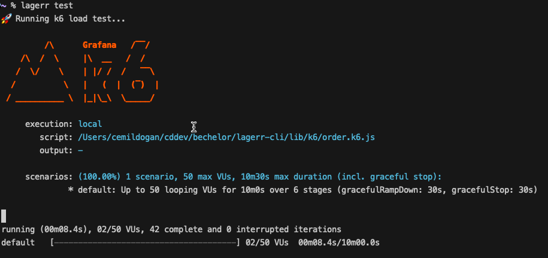

## Some of the questions that are asked 

### Quellcode aller vier Microservices

In the `lagerr` repo under the services/ folder (https://github.com/cemildo/lagerr/tree/main/services), you can find:

order
payment
notification
lager

There’s also lager-messaging, which is a shared module.


### Kubernetes-Manifeste / Helm Charts
Each service has its own Kubernetes file k8s/deployment.yaml  inside its folder.

There are also:

central Kubernetes configs under apps/
a Helm chart for PostgreSQL under charts/postgresql

### lagerr-cli Quellcode
The CLI tool is in the lagerr-cli repo.

Main parts:

bin/lagerr.js -> main CLI entry point
lib/ -> contains commands like setup, load, destroy, test


### Docker-Konfigurationen
every service has its own Dockerfile inside its folder.


### RabbitMQ-Konfiguration
RabbitMQ is used and set up during the CLI process (namespace + port-forwarding), and credentials are mentioned in the README.

https://github.com/cemildo/lagerr/blob/main/apps/infra/rabbitmq.yaml

