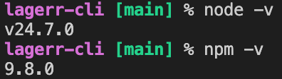

# lager-cli
An npm library to manage local kubernetes infrastructure setup cluster, load services, test and destroy cluster functionality.

## 1 -  node and npm versions


## 2 - downlaod both lagerr and lagerr-cli 
make sure you download both repos in the same folder because we will need to set up root path for lagerr-cli to find files under infrastructure folder.


## 3 - navigate into lagerr-cli
> `npm install -g . `
this will install the library in your computer in the global npm folders, so it is usable in every terminal you open. if it does not appear in your current terminal, close the terminal session and open a new one and type `lagerr` you should get some thing like: 


## 4 - install local kubernetes 
run `lagerr setup` this will install all the necessary components and it take scouple of minutes. in the installation process it will ask you the root path:


open a new terminal and navigate into your infrastructure folder and run `pwd` this will give you the root path relative to your computer. for me it is `/Users/cemildogan/cddev/bechelor/infrastructur` copy and paste it in the `lagerr setup` terminal and hit enter. It will continue install and finally you should see the following screen:


now, when you open `docker desktop` you should see `lagerr-control-plane` is up and running


a minute or so needed to start all the containers to be up and ready. I personally use a tool Lens (`https://lenshq.io/products/lens-k8s-ide`) to take a look at inside kubernetes and run some commands. this tool had a problem and in order to find local cluster it needs to be started from the terminal if you prefer to have it, install it and run it by `open -a Lens` command. this will bring up the following screen.


## 5 - get postgtres ready

check if postgres pod is installed and deployed, if not you need to `lagerr destroy` and `lagerr setup` again. :/

- if you find postgres pod then you should connect to it:
  * check if port 5432 is forwarded, if not, do the forwarding in kubernetes `kubectl port-forward pod/<pod-name> 5432:5432`. 
  
  then use this password  `app123` and following settings to connect database with a program that allows you to connect and run queries on database.


- add following schema: 
   

## 5 - deploying services
Right now non of the services are deployed we need to deploy them one by one.

open a terminal and run `lagerr load order` this will build the order microservice image and deploy it to local kubernetes cluster (depending on where you run this command it might ask for permission hit `allow`).
If everything is successfull, you should see the following screen, whci means service is successfully deployed. 


then run the rest one by one `lagerr load notification`, `lagerr load payment`, `lagerr load lager`

if you would like to change any environment variable (SAGA -> SAGA_OUTBOX or SAGA_OUTBOX -> SAGA)you can change it under each service `k8s/deployment.yaml` and in the `env: ...` section and run deployment script again `lagerr load <service-name>`. Or you can change it directly in kubernetes related deployment.yaml and restart the pod.


## Monitoring tools 
you can also visit monitoring tools in the browser: 

for RabbitMQ: `rmq.localhost` in the browser, and the credentials are:
- user: `app`
- pass: `app123`
  


for Grafana: type `monitoring.localhost` in the browser, and the credentials are:

- user: `admin`
- pass: `kubectl get secret --namespace monitoring -l app.kubernetes.io/component=admin-secret -o jsonpath="{.items[0].data.admin-password}" | base64 --decode ; echo` or alternatively you can take a look env varibales of monitoring-grafana-xxxxxxxx pod (the password is not fixed password, it changes on every new cluster setup) where you can also find the password. 

as you see below in the image, i have created a dedicated dashbord which shows a lot of related metrics.


## Testing with postman

Run this query from terminal 

```
curl --location 'proxy.localhost/order/api/orders' \
--header 'Content-Type: application/json' \
--data '{
    "customerId": "4e8d1455-c201-474f-a7f4-4df1acb2978c",
    "items": [
        {
            "productId": "e1690c12-1000-4b01-b4b1-000000000006",
            "quantity": 1
        },
        {
            "productId": "e1690c12-1000-4b01-b4b1-000000000003",
            "quantity": 1
        }
    ]
}'
```

you should get some think like this as response:

```
{
    "id":"f3238a97-bc64-41ab-8bd0-255b1e6d7d3c","customerId":"4e8d1455-c201-474f-a7f4-4df1acb2978c","totalAmount":2098.00,"status":"PAYMENT_PENDING","createdAt":"2026-04-12T22:47:14.753086591Z","updatedAt":"2026-04-12T22:47:14.753086591Z"
}
```

## Testing with k6

run the following command in a terminal to start grafana k6 tests: `lagerr test`.

